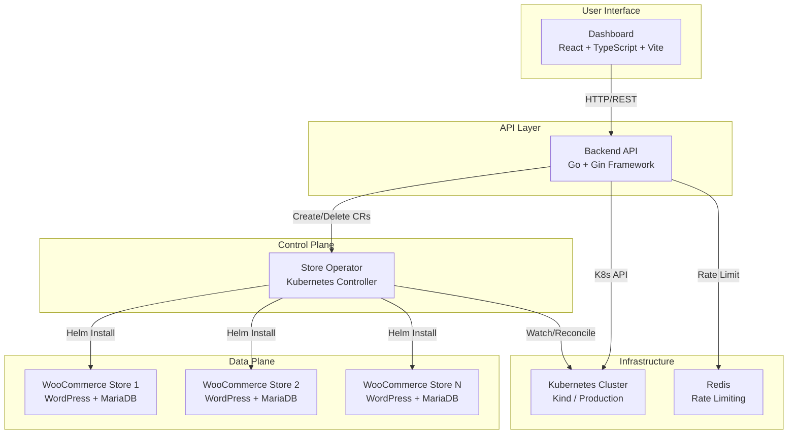

# Store Platform

A comprehensive Kubernetes-native platform for provisioning and managing WooCommerce stores on demand. This platform demonstrates production-grade microservices architecture with a custom Kubernetes operator, RESTful API backend, and modern React dashboard.

## 🏗️ Architecture Overview

The Store Platform consists of four main components working together:



### Component Responsibilities

| Component | Technology | Purpose |
|-----------|-----------|---------|
| **Dashboard** | React, TypeScript, Vite, TailwindCSS | User interface for managing stores |
| **Backend API** | Go, Gin, Kubernetes Client-Go | RESTful API with authentication and rate limiting |
| **Operator** | Go, Kubebuilder, Helm SDK | Kubernetes controller managing Store lifecycle |
| **Helm Chart** | Bitnami WordPress Chart | WooCommerce deployment template |

## 📋 Table of Contents

- [Architecture Overview](#-architecture-overview)
- [Components](#-components-in-detail)
  - [Kubernetes Operator](#1-kubernetes-operator)
  - [Backend API](#2-backend-api)
  - [Dashboard](#3-dashboard)
  - [Helm Charts](#4-helm-charts)
- [Prerequisites](#-prerequisites)
- [Local Development Setup](#-local-development-setup)
- [Production Deployment](#-production-deployment)
- [API Reference](#-api-reference)
- [Custom Resource Definition](#-custom-resource-definition-crd)
- [Configuration](#-configuration)
- [Development Workflow](#-development-workflow)
- [Monitoring & Observability](#-monitoring--observability)
- [Troubleshooting](#-troubleshooting)

## 🔧 Components in Detail

### 1. Kubernetes Operator

**Location:** `operator/`

A production-grade Kubernetes operator built with Kubebuilder that manages the complete lifecycle of Store custom resources.

#### Features

- **Custom Resource Management**: Defines and reconciles `Store` CRD in the `infra.store.io/v1alpha1` API group
- **Automated Provisioning**: Uses Helm SDK to install WooCommerce (WordPress + WooCommerce) in isolated namespaces
- **Resource Guardrails**: Enforces ResourceQuotas, LimitRanges, and NetworkPolicies per store
- **Secure Credentials**: Generates and manages database passwords and WordPress credentials via Kubernetes Secrets
- **Finalizer Pattern**: Ensures clean resource deletion (Helm release → PVCs → Namespace → Finalizer)
- **Health Monitoring**: Watches Pod readiness before marking stores as "Ready"
- **Prometheus Metrics**: Exposes metrics for store creation, deletion, and provisioning time
- **Kubernetes Events**: Emits events for lifecycle phases (Provisioning, Ready, Failed)

#### Store Custom Resource Spec

```yaml
apiVersion: infra.store.io/v1alpha1
kind: Store
metadata:
  name: my-store
spec:
  engine: woo              # Store engine type (woo, medusa)
  plan: small              # Resource tier (small, medium, large)
```

#### Status Fields

- **Phase**: `Provisioning`, `Ready`, `Failed`
- **URL**: Public endpoint (e.g., `http://my-store.165.22.215.118.nip.io`)
- **Message**: Human-readable state description
- **Reason**: Machine-readable reason code
- **ObservedGeneration**: Last reconciled spec version

#### Key Files

- [`api/v1alpha1/store_types.go`](operator/api/v1alpha1/store_types.go) - CRD schema definition
- [`internal/controller/store_controller.go`](operator/internal/controller/store_controller.go) - Reconciliation logic
- [`internal/controller/metrics.go`](operator/internal/controller/metrics.go) - Prometheus metrics
- [`internal/controller/namespace_resources.go`](operator/internal/controller/namespace_resources.go) - Resource guardrails
- [`internal/helm/installer.go`](operator/internal/helm/installer.go) - Helm installation logic

### 2. Backend API

**Location:** `backend/`

A RESTful API server written in Go using the Gin framework, serving as the platform's control plane.

#### Features

- **RESTful Endpoints**: CRUD operations for Store resources
- **Kubernetes Integration**: Direct interaction with K8s API using client-go
- **Rate Limiting**: Configurable rate limiting with Redis or in-memory backends
- **Health Checks**: `/healthz` (liveness) and `/readyz` (readiness) endpoints
- **Structured Logging**: JSON-formatted logs with slog
- **Graceful Shutdown**: 10-second timeout for in-flight requests
- **CORS Support**: Configured for cross-origin requests from dashboard
- **Request Auditing**: Middleware for tracking API calls

#### API Endpoints

| Method | Path | Description |
|--------|------|-------------|
| `GET` | `/healthz` | Liveness probe |
| `GET` | `/readyz` | Readiness probe |
| `POST` | `/api/v1/stores` | Create a new store |
| `GET` | `/api/v1/stores` | List all stores (optional `?namespace=` filter) |
| `GET` | `/api/v1/stores/:name` | Get store details |
| `DELETE` | `/api/v1/stores/:name` | Delete a store |

#### Configuration

Environment variables:

```bash
LISTEN_ADDR=:8080                # Server listen address
ENV=production                   # Environment (dev/production)
KUBECONFIG=/path/to/config       # Kubernetes config (optional, uses in-cluster by default)
REDIS_ADDR=redis:6379            # Redis address (optional, uses memory if not set)
RATE_LIMIT=3                     # Requests per time window
RATE_WINDOW=1m                   # Rate limit window duration
LOG_LEVEL=info                   # Logging level
```

#### Key Files

- [`cmd/api/main.go`](backend/cmd/api/main.go) - Application entrypoint
- [`internal/api/router.go`](backend/internal/api/router.go) - Route definitions
- [`internal/api/handlers/store_handler.go`](backend/internal/api/handlers/store_handler.go) - Store API handlers
- [`internal/service/store_service.go`](backend/internal/service/store_service.go) - Business logic
- [`internal/infrastructure/k8s/client.go`](backend/internal/infrastructure/k8s/client.go) - Kubernetes client
- [`internal/config/config.go`](backend/internal/config/config.go) - Configuration loader

### 3. Dashboard

**Location:** `dashboard/`

A modern React single-page application built with Vite, TypeScript, and TailwindCSS.

#### Features

- **Store Management UI**: Create, view, list, and delete stores
- **Real-time Updates**: Uses TanStack Query for efficient data fetching
- **Responsive Design**: TailwindCSS v4 for modern, mobile-friendly UI
- **Type Safety**: Full TypeScript coverage
- **Form Validation**: React Hook Form with Zod schemas
- **Component Library**: Radix UI primitives with custom styling
- **Fast Development**: Vite for instant HMR and optimized builds

#### Tech Stack

```json
{
  "framework": "React 19",
  "language": "TypeScript 5.9",
  "bundler": "Vite 7",
  "styling": "TailwindCSS 4",
  "state": "TanStack Query 5",
  "routing": "React Router 7",
  "forms": "React Hook Form 7",
  "validation": "Zod 4",
  "icons": "Lucide React",
  "components": "Radix UI"
}
```

#### Key Files

- [`src/App.tsx`](dashboard/src/App.tsx) - Application root with routing
- [`src/pages/Dashboard.tsx`](dashboard/src/pages/Dashboard.tsx) - Main dashboard page
- [`src/api/stores.ts`](dashboard/src/api/stores.ts) - API client functions
- [`src/components/`](dashboard/src/components/) - Reusable UI components

### 4. Helm Charts

**Location:** `charts/engine-woo/`

A wrapper Helm chart that deploys the Bitnami WordPress chart pre-configured for WooCommerce.

#### Chart Structure

```yaml
# charts/engine-woo/Chart.yaml
apiVersion: v2
name: engine-woo
description: A wrapper chart for WooCommerce
type: application
version: 0.1.0
dependencies:
  - name: wordpress
    version: "*"
    repository: https://charts.bitnami.com/bitnami
```

The operator overrides values to:
- Enable Ingress with dynamic hostname (`{store-name}.{base-domain}`)
- Inject secure credentials from Kubernetes Secrets
- Configure resource limits based on plan
- Disable persistence for local development (configurable)

## 🔐 Prerequisites

### Required Software

| Tool | Version | Purpose |
|------|---------|---------|
| [Go](https://go.dev/dl/) | 1.23+ | Backend and operator development |
| [Node.js](https://nodejs.org/) | 20+ | Dashboard development |
| [Bun](https://bun.sh/) | Latest | Dashboard package manager |
| [Docker](https://docs.docker.com/get-docker/) | 20+ | Container builds |
| [kubectl](https://kubernetes.io/docs/tasks/tools/) | 1.28+ | Kubernetes CLI |
| [Kind](https://kind.sigs.k8s.io/) | 0.20+ | Local Kubernetes cluster |
| [Helm](https://helm.sh/docs/intro/install/) | 3.12+ | Chart management |

### Optional Tools

- **Make**: For using Makefiles in operator/backend
- **golangci-lint**: For Go code linting
- **jq**: For JSON parsing in scripts

## 🚀 Local Development Setup

This section walks through setting up the entire platform locally using Kind (Kubernetes in Docker).

### Step 1: Create Kind Cluster

The provided `kind.yaml` configures a cluster with port 80 mapped for Ingress:

```bash
# Create cluster
kind create cluster --config kind.yaml --name store-platform

# Verify cluster is running
kubectl cluster-info --context kind-store-platform
```

### Step 2: Install NGINX Ingress Controller

```bash
# Install NGINX Ingress Controller
kubectl apply -f https://raw.githubusercontent.com/kubernetes/ingress-nginx/main/deploy/static/provider/kind/deploy.yaml

# Wait for ingress controller to be ready
kubectl wait --namespace ingress-nginx \
  --for=condition=ready pod \
  --selector=app.kubernetes.io/component=controller \
  --timeout=90s
```

### Step 3: Install Redis (Optional, for Rate Limiting)

```bash
# Deploy Redis
kubectl apply -f deploy/redis/redis.yaml

# Verify Redis is running
kubectl get pods -l app=redis
```

### Step 4: Deploy the Operator

#### Option A: Using Pre-built Image

```bash
# Install CRDs
kubectl apply -f deploy/crds/store.yaml

# Deploy operator
kubectl apply -f deploy/operator/operator.yaml

# Verify operator is running
kubectl get pods -l app=store-operator
kubectl logs -l app=store-operator -f
```

#### Option B: Local Development Mode

```bash
cd operator

# Install CRDs
make install

# Run operator locally (outside cluster)
make run

# In another terminal, create a test store
kubectl apply -f config/samples/infra_v1alpha1_store.yaml
```

### Step 5: Deploy the Backend API

#### Option A: Using Pre-built Image

```bash
# Deploy backend
kubectl apply -f deploy/backend/backend.yaml
kubectl apply -f deploy/backend/ingress.yaml

# Verify backend is running
kubectl get pods -l app=store-backend
kubectl logs -l app=store-backend -f

# Test API (if you have ingress configured)
curl http://api.127.0.0.1.nip.io/healthz
```

#### Option B: Local Development Mode

```bash
cd backend

# Install dependencies
go mod download

# Run locally
KUBECONFIG=~/.kube/config go run cmd/api/main.go

# In another terminal, test the API
curl http://localhost:8080/healthz
curl http://localhost:8080/api/v1/stores
```

### Step 6: Run the Dashboard

```bash
cd dashboard

# Install dependencies
bun install

# Start development server
bun run dev

# Open browser to http://localhost:5173
```

Configure the API URL in `.env.development`:

```bash
VITE_API_URL=http://localhost:8080/api/v1
```

### Step 7: Create Your First Store

#### Via Dashboard

1. Open `http://localhost:5173` in your browser
2. Click "Create Store"
3. Fill in store name, select engine (woo), and plan (small)
4. Submit and watch the store provision

#### Via API

```bash
curl -X POST http://localhost:8080/api/v1/stores \
  -H "Content-Type: application/json" \
  -d '{
    "name": "demo-store",
    "engine": "woo",
    "plan": "small"
  }'
```

#### Via kubectl

```yaml
# store.yaml
apiVersion: infra.store.io/v1alpha1
kind: Store
metadata:
  name: demo-store
  namespace: default
spec:
  engine: woo
  plan: small
```

```bash
kubectl apply -f store.yaml

# Watch the store provision
kubectl get store demo-store -w

# Get the store URL
kubectl get store demo-store -o jsonpath='{.status.url}'
```

### Step 8: Access Your Store

Once the store reaches "Ready" phase, you can access it:

```bash
# Get store URL
kubectl get store demo-store -o jsonpath='{.status.url}'
# Output: http://demo-store.127.0.0.1.nip.io

# Open in browser
open $(kubectl get store demo-store -o jsonpath='{.status.url}')
```

## 🌍 Production Deployment

### Building Docker Images

Each component has its own Dockerfile optimized for production.

#### Backend

```bash
cd backend

# Build image
docker build -t ghcr.io/jovial-kanwadia/store-backend:latest .

# Push to registry
docker push ghcr.io/jovial-kanwadia/store-backend:latest
```

#### Operator

```bash
cd operator

# Build image (multi-platform support)
make docker-build IMG=ghcr.io/jovial-kanwadia/store-operator:latest

# Push to registry
make docker-push IMG=ghcr.io/jovial-kanwadia/store-operator:latest
```

#### Dashboard

```bash
cd dashboard

# Build image
docker build -t ghcr.io/jovial-kanwadia/store-dashboard:latest .

# Push to registry
docker push ghcr.io/jovial-kanwadia/store-dashboard:latest
```

### Deploying to Production Cluster

1. **Update Image References**: Edit deployment manifests in `deploy/` to use your registry
2. **Configure Domain**: Set `BASE_DOMAIN` environment variable for the operator
3. **Set Secrets**: Configure Redis credentials if using external Redis
4. **Apply Manifests**:

```bash
# Install CRDs
kubectl apply -f deploy/crds/

# Deploy operator
kubectl apply -f deploy/operator/

# Deploy backend
kubectl apply -f deploy/backend/

# Deploy dashboard
kubectl apply -f deploy/dashboard/
```

### Environment-Specific Configurations

Production overrides are available in `deploy/environments/prod/`:

```bash
# Apply production configurations
kubectl apply -k deploy/environments/prod/
```

## 📚 API Reference

### Create Store

```http
POST /api/v1/stores
Content-Type: application/json

{
  "name": "my-store",
  "engine": "woo",
  "plan": "medium",
  "namespace": "default"  // optional
}
```

**Response** (201 Created):

```json
{
  "name": "my-store",
  "namespace": "default",
  "engine": "woo",
  "plan": "medium",
  "status": "Provisioning",
  "url": "",
  "createdAt": "2026-02-13T12:00:00Z"
}
```

### List Stores

```http
GET /api/v1/stores?namespace=default
```

**Response** (200 OK):

```json
[
  {
    "name": "store-1",
    "namespace": "default",
    "engine": "woo",
    "plan": "small",
    "status": "Ready",
    "url": "http://store-1.example.com",
    "createdAt": "2026-02-13T11:00:00Z"
  }
]
```

### Get Store

```http
GET /api/v1/stores/my-store?namespace=default
```

**Response** (200 OK):

```json
{
  "name": "my-store",
  "namespace": "default",
  "engine": "woo",
  "plan": "medium",
  "status": "Ready",
  "url": "http://my-store.example.com",
  "createdAt": "2026-02-13T12:00:00Z"
}
```

### Delete Store

```http
DELETE /api/v1/stores/my-store?namespace=default
```

**Response** (204 No Content)

### Error Responses

```json
{
  "error": "store already exists"
}
```

Status codes:
- `400` - Bad request (validation error)
- `404` - Store not found
- `409` - Conflict (store already exists)
- `429` - Rate limit exceeded
- `500` - Internal server error

## 🔖 Custom Resource Definition (CRD)

### Store CRD Spec

```yaml
apiVersion: infra.store.io/v1alpha1
kind: Store
metadata:
  name: example-store
  namespace: default
spec:
  # Engine type: currently supports "woo" for WooCommerce
  # Future: "medusa" for Medusa.js
  engine: woo
  
  # Resource plan: defines resource limits and quotas
  # Options: small, medium, large
  plan: medium
```

### Status Subresource

The operator updates the status with:

```yaml
status:
  # Current lifecycle phase
  phase: Ready  # Provisioning | Ready | Failed
  
  # Public URL to access the store
  url: http://example-store.165.22.215.118.nip.io
  
  # Human-readable message (shown during provisioning/failures)
  message: "Waiting for pods to become ready..."
  
  # Machine-readable reason code
  reason: "WaitingForPods"  # Provisioning | HelmError | WaitingForPods
  
  # Last spec generation that was reconciled
  observedGeneration: 1
  
  # Detailed condition history
  conditions:
    - type: Ready
      status: "True"
      lastTransitionTime: "2026-02-13T12:05:00Z"
      reason: StoreReady
      message: Store provisioned successfully
```

## ⚙️ Configuration

### Operator Configuration

Set via environment variables in `deploy/operator/operator.yaml`:

| Variable | Default | Description |
|----------|---------|-------------|
| `WORDPRESS_CHART_PATH` | `../charts/engine-woo` | Path to Helm chart |
| `BASE_DOMAIN` | `127.0.0.1.nip.io` | Base domain for store URLs |

### Backend Configuration

Set via environment variables in `deploy/backend/backend.yaml`:

| Variable | Default | Description |
|----------|---------|-------------|
| `LISTEN_ADDR` | `:8080` | Server listen address |
| `ENV` | `dev` | Environment name |
| `KUBECONFIG` | `` | Path to kubeconfig (empty = in-cluster) |
| `REDIS_ADDR` | `` | Redis address (empty = memory limiter) |
| `RATE_LIMIT` | `3` | Max requests per window |
| `RATE_WINDOW` | `1m` | Rate limit time window |
| `LOG_LEVEL` | `info` | Log level (debug/info/warn/error) |

### Dashboard Configuration

Set via environment files:

**`.env.development`** (local):
```bash
VITE_API_URL=http://localhost:8080/api/v1
```

**`.env.production`** (production):
```bash
VITE_API_URL=https://api.example.com/api/v1
```

## 🛠️ Development Workflow

### Operator Development

```bash
cd operator

# Generate CRDs and Go code after modifying types
make manifests generate

# Run tests
make test

# Run linter
make lint

# Build binary locally
make build

# Run operator locally (watches cluster)
make run
```

### Backend Development

```bash
cd backend

# Format code
go fmt ./...

# Run linter
golangci-lint run

# Run tests
go test ./...

# Build binary
go build -o bin/api cmd/api/main.go

# Run locally
./bin/api
```

### Dashboard Development

```bash
cd dashboard

# Start dev server with hot reload
bun run dev

# Type checking
bun run tsc --noEmit

# Lint
bun run lint

# Build for production
bun run build

# Preview production build
bun run preview
```

### Testing End-to-End

1. **Start all components locally**:
   - Terminal 1: `cd operator && make run`
   - Terminal 2: `cd backend && go run cmd/api/main.go`
   - Terminal 3: `cd dashboard && bun run dev`

2. **Create a store via dashboard**:
   - Open `http://localhost:5173`
   - Create a new store

3. **Verify operator reconciliation**:
   ```bash
   kubectl get store -w
   kubectl describe store <store-name>
   kubectl get pods -n store-<store-name>
   ```

4. **Check backend logs**:
   ```bash
   # Backend should show API requests
   ```

5. **Access the provisioned store**:
   ```bash
   kubectl get store <store-name> -o jsonpath='{.status.url}'
   ```

## 📊 Monitoring & Observability

### Kubernetes Events

The operator emits events during reconciliation:

```bash
# View events for a store
kubectl describe store demo-store

# Events:
#   Type    Reason        Message
#   ----    ------        -------
#   Normal  Provisioning  Started provisioning store demo-store
#   Normal  Ready         Store is ready at URL http://demo-store.127.0.0.1.nip.io
```

### Prometheus Metrics

The operator exposes metrics on port `8080` at `/metrics`:

| Metric | Type | Description |
|--------|------|-------------|
| `store_created_total` | Counter | Total stores created |
| `store_deletion_total` | Counter | Total stores deleted |
| `store_provisioning_seconds` | Histogram | Time to provision a store |

**Example Prometheus scrape config**:

```yaml
scrape_configs:
  - job_name: 'store-operator'
    kubernetes_sd_configs:
      - role: pod
    relabel_configs:
      - source_labels: [__meta_kubernetes_pod_label_app]
        action: keep
        regex: store-operator
```

### Structured Logging

Both operator and backend use structured JSON logging:

```bash
# Operator logs
kubectl logs -l app=store-operator -f

# Backend logs
kubectl logs -l app=store-backend -f

# Example log entry
{
  "level": "info",
  "ts": 1707825600,
  "msg": "Reconciling Store",
  "store": "demo-store",
  "namespace": "default",
  "phase": "Provisioning"
}
```

## 🐛 Troubleshooting

### Store Stuck in "Provisioning"

**Symptoms**: Store phase remains "Provisioning" for > 5 minutes

**Diagnosis**:

```bash
# Check store status
kubectl describe store <store-name>

# Check operator logs
kubectl logs -l app=store-operator -f

# Check pods in store namespace
kubectl get pods -n store-<store-name>

# Check pod logs
kubectl logs -n store-<store-name> <pod-name>
```

**Common causes**:
1. **Slow image pull**: Check `kubectl describe pod` for `ImagePullBackOff`
2. **Insufficient resources**: Check if pods are pending due to CPU/memory
3. **Liveness probe failure**: Increase `livenessProbe.initialDelaySeconds` in operator values
4. **Chart path misconfigured**: Verify `WORDPRESS_CHART_PATH` in operator deployment

### Namespace Won't Delete (Finalizer Issue)

**Symptoms**: Namespace stuck in "Terminating" state

**Diagnosis**:

```bash
kubectl get namespace store-<store-name> -o yaml
```

**Fix**:

The operator implements a safe deletion flow:
1. Uninstall Helm release
2. Delete PVCs
3. Delete namespace
4. Remove finalizer

If stuck, check operator logs for errors during uninstallation.

### Backend Can't Create Stores (RBAC)

**Symptoms**: API returns 500 error when creating stores

**Diagnosis**:

```bash
# Check backend logs
kubectl logs -l app=store-backend

# Error example: "User \"system:serviceaccount:default:backend-sa\" cannot create resource \"stores\""
```

**Fix**:

Verify RBAC permissions:

```bash
kubectl auth can-i create stores.infra.store.io --as=system:serviceaccount:default:backend-sa
```

If "no", reapply backend RBAC:

```bash
kubectl apply -f deploy/backend/backend.yaml
```

### Dashboard Can't Connect to Backend

**Symptoms**: Dashboard shows "Network Error" or CORS errors

**Diagnosis**:

1. Check browser console for errors
2. Verify `VITE_API_URL` in `.env` file
3. Check backend is running: `curl http://localhost:8080/healthz`

**Fix**:

```bash
# Update .env.development
echo "VITE_API_URL=http://localhost:8080/api/v1" > dashboard/.env.development

# Restart dashboard dev server
cd dashboard
bun run dev
```

### Rate Limit Errors (429)

**Symptoms**: API returns `{"error": "rate limit exceeded"}`

**Diagnosis**:

Check backend configuration:

```bash
kubectl get deployment store-backend -o yaml | grep -A2 RATE_LIMIT
```

**Fix**:

Increase rate limit or window:

```yaml
# deploy/backend/backend.yaml
env:
  - name: RATE_LIMIT
    value: "10"        # Increase from 3 to 10
  - name: RATE_WINDOW
    value: "1m"
```

### Helm Installation Fails

**Symptoms**: Store phase is "Failed" with message "Helm install failed"

**Diagnosis**:

```bash
# Check operator logs
kubectl logs -l app=store-operator -f | grep -A10 "Helm install failed"

# Check if chart exists
ls -la operator/charts/engine-woo/

# Check Helm releases
helm list -n store-<store-name>
```

**Fix**:

1. Verify chart dependencies are pulled:
   ```bash
   cd operator/charts/engine-woo
   helm dependency update
   ```

2. Verify chart path in operator deployment:
   ```bash
   kubectl set env deployment/store-operator WORDPRESS_CHART_PATH=/charts/engine-woo
   ```

### MariaDB Password Errors (After Store Re-creation)

**Symptoms**: Store fails with "password authentication failed"

**Root cause**: Credentials changed between deletions but PVC still has old data

**Fix** (already implemented in operator):
- Operator generates stable credentials in `<store-name>-creds` Secret
- Credentials persist across reconciliations
- Clean deletion flow removes PVCs before namespace deletion

## 📝 License

Copyright 2026.

Licensed under the Apache License, Version 2.0 (the "License");
you may not use this file except in compliance with the License.
You may obtain a copy of the License at

    http://www.apache.org/licenses/LICENSE-2.0

Unless required by applicable law or agreed to in writing, software
distributed under the License is distributed on an "AS IS" BASIS,
WITHOUT WARRANTIES OR CONDITIONS OF ANY KIND, either express or implied.
See the License for the specific language governing permissions and
limitations under the License.

## 🤝 Contributing

Contributions are welcome! Please follow these guidelines:

1. **Fork the repository**
2. **Create a feature branch**: `git checkout -b feature/my-feature`
3. **Make your changes** with tests and documentation
4. **Run linters**: `make lint` in operator/backend, `bun run lint` in dashboard
5. **Run tests**: `make test` in operator, `go test ./...` in backend
6. **Commit with conventional commits**: `feat:`, `fix:`, `docs:`, etc.
7. **Push and create a Pull Request**
